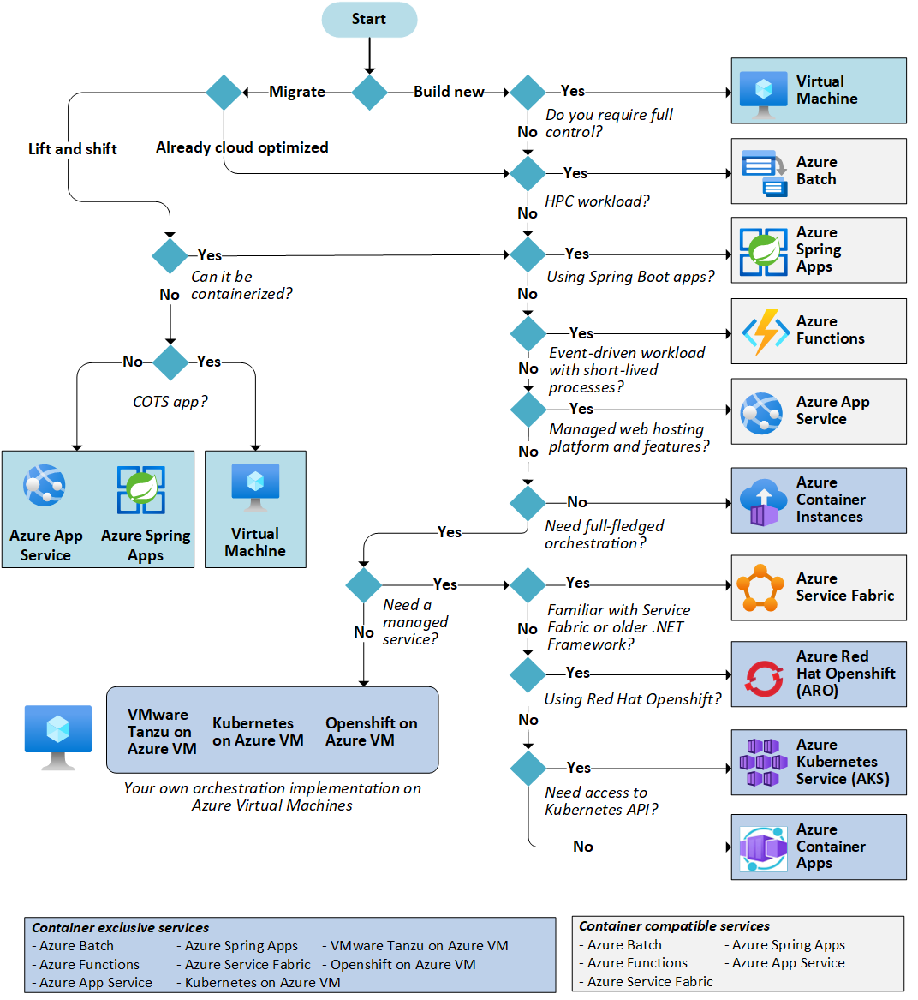

# upgrade-migrate-az-strategy

### Migration Steps:

    - Assessment and Planning
    - Containerization
    - Provisioning Kubernetes Cluster
    - Deployment and Orchestration
    - Testing and Validation
    - Data Migration
    - Cut-over and Transition
    - Performance Measurement
    - Reliability and Availability 
    - Continuous Improvement 
    -  

`Assessment and Planning:`

Assess the current infrastructure and identify the dependencies, configurations, and interdependencies between services.
Determine the target Kubernetes cluster provider and establish the necessary infrastructure.
Define the migration strategy, considering the criticality of services and minimizing downtime.
Identify any necessary modifications or optimizations required for containerization.

`Containerization:`

Create Docker containers for each service/component, ensuring all dependencies are included.
Validate and test the containers locally to ensure they work as expected.
Push the container images to a container registry accessible by the Kubernetes cluster.

`Provisioning Kubernetes Cluster:`

Use Terraform to provision the Kubernetes cluster on the target infrastructure.
Configure necessary networking, security, and storage resources for the cluster.

`Deployment and Orchestration:`

Create Helm charts for each service/component, specifying dependencies, resource requirements, and configuration.
Deploy the stateless services using Kubernetes Deployments and Services.
Deploy the stateful components using StatefulSets and Persistent Volumes.
Configure Ingress resources to handle routing and expose publicly accessible services.
Gradually migrate traffic from the existing platform to the new Kubernetes cluster.

`Testing and Validation:`

Perform comprehensive testing of the migrated services to ensure functionality and compatibility.
Validate the communication between services, both internal and external.
Monitor performance, resource utilization, and reliability during the testing phase.

`Data Migration:`

Develop a plan for migrating data from the existing databases to the new Kubernetes-compatible database solutions.
Determine the best approach based on the database types and sizes, such as using database migration tools or writing custom migration scripts.
Perform thorough testing to ensure data integrity and consistency after the migration.

`Cut-over and Transition:`

Plan a maintenance window for the final cut-over from the old platform to the new Kubernetes-based platform.
Coordinate with stakeholders to minimize disruption, schedule appropriate downtime, and communicate the transition plan.
Implement the cut-over by updating DNS records, switching traffic to the new platform, and decommissioning the old infrastructure.
Monitor closely during and after the cut-over to address any unforeseen issues promptly.
Administration and Control:

`Performance Measurement:`

Implement monitoring and observability solutions for the Kubernetes cluster using tools like Prometheus, Grafana, and Kubernetes-native monitoring solutions.
Define and monitor key performance indicators (KPIs) such as response times, error rates, resource utilization, and throughput.
Utilize log aggregation tools to capture and analyze application logs for troubleshooting and performance optimization.

`Reliability and Availability:`

Implement automated scaling mechanisms to handle increased load and ensure high availability.
Implement fault-tolerant patterns like replicas, health checks, and readiness probes to handle failures gracefully.
Utilize Kubernetes features like rolling updates and canary deployments for seamless updates and minimal downtime.
Regularly perform backups of critical data and implement disaster recovery mechanisms to ensure data integrity and availability.

`Continuous Improvement:`

Establish a feedback loop for monitoring and addressing customer-reported issues.
Conduct regular performance reviews and capacity planning to identify bottlenecks and optimize resource allocation.
Maintain an agile development and deployment process to enable iterative improvements and feature enhancements.
Stay updated with the latest Kubernetes and containerization best practices to leverage new features and improvements.

*Note: The above steps and principles provide a general framework for the migration and administration of the platform. The specific details and tool selection may vary based on the organization's requirements, existing infrastructure, and preferences.*

#### Flow Diagram

##  Follow-Me 

